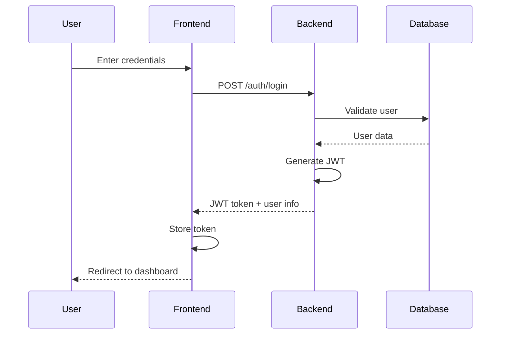
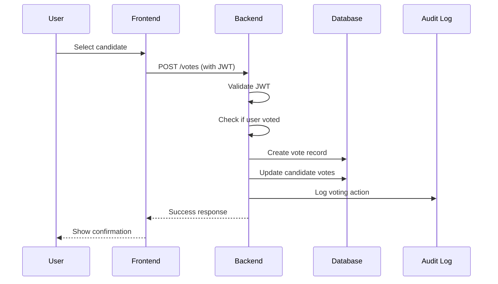
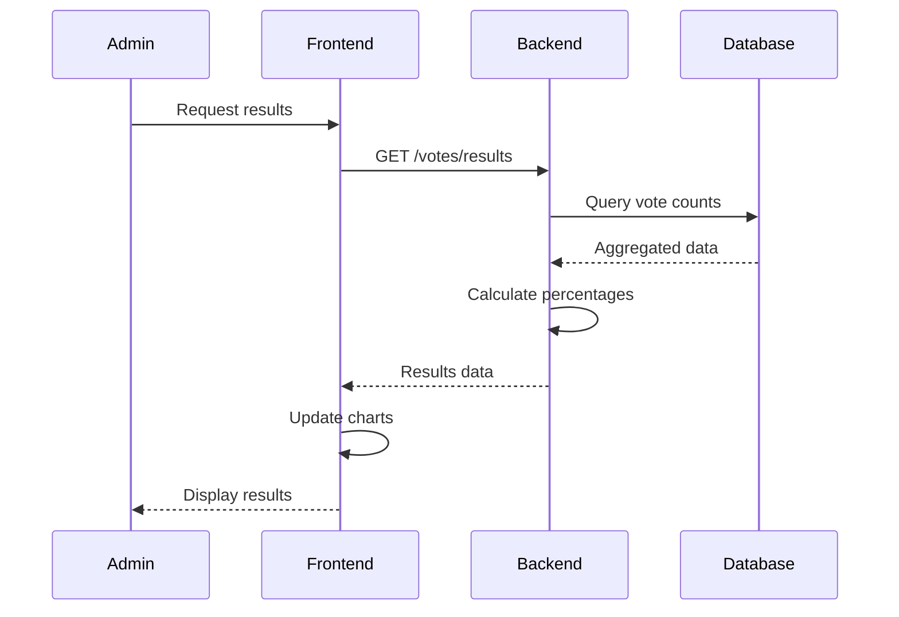

# Architecture Overview

This document provides a comprehensive overview of the Electronic Voting System architecture, including system design, components, data flow, and security considerations.

## Table of Contents

1. [System Architecture](#system-architecture)
2. [Component Overview](#component-overview)
3. [Data Flow](#data-flow)
4. [Database Design](#database-design)
5. [Security Architecture](#security-architecture)
6. [API Design](#api-design)
7. [Frontend Architecture](#frontend-architecture)
8. [Deployment Architecture](#deployment-architecture)
9. [Scalability Considerations](#scalability-considerations)

## System Architecture

### High-Level Architecture

```
┌─────────────────────────────────────────────────────────────────┐
│                        Client Layer                             │
├─────────────────────────────────────────────────────────────────┤
│  Web Browser (React SPA)  │  Mobile Browser  │  Admin Panel    │
└─────────────────────────────────────────────────────────────────┘
                                    │
                                    │ HTTPS/REST API
                                    ▼
┌─────────────────────────────────────────────────────────────────┐
│                     Presentation Layer                          │
├─────────────────────────────────────────────────────────────────┤
│              Nginx (Reverse Proxy & Load Balancer)             │
└─────────────────────────────────────────────────────────────────┘
                                    │
                                    ▼
┌─────────────────────────────────────────────────────────────────┐
│                     Application Layer                           │
├─────────────────────────────────────────────────────────────────┤
│                    NestJS Backend Server                       │
│  ┌─────────────┐ ┌─────────────┐ ┌─────────────┐ ┌───────────┐ │
│  │    Auth     │ │ Candidates  │ │    Votes    │ │   Users   │ │
│  │   Module    │ │   Module    │ │   Module    │ │  Module   │ │
│  └─────────────┘ └─────────────┘ └─────────────┘ └───────────┘ │
│  ┌─────────────┐ ┌─────────────┐ ┌─────────────┐ ┌───────────┐ │
│  │ Audit Logs  │ │ Validation  │ │   Guards    │ │   Pipes   │ │
│  │   Module    │ │   Layer     │ │   Layer     │ │   Layer   │ │
│  └─────────────┘ └─────────────┘ └─────────────┘ └───────────┘ │
└─────────────────────────────────────────────────────────────────┘
                                    │
                                    ▼
┌─────────────────────────────────────────────────────────────────┐
│                      Data Layer                                 │
├─────────────────────────────────────────────────────────────────┤
│                    TypeORM (ORM Layer)                         │
│                           │                                     │
│                           ▼                                     │
│                   SQLite Database                               │
│  ┌─────────────┐ ┌─────────────┐ ┌─────────────┐ ┌───────────┐ │
│  │    users    │ │ candidates  │ │    votes    │ │audit_logs │ │
│  │    table    │ │    table    │ │    table    │ │   table   │ │
│  └─────────────┘ └─────────────┘ └─────────────┘ └───────────┘ │
└─────────────────────────────────────────────────────────────────┘
```

### Architecture Principles

1. **Separation of Concerns**: Clear separation between presentation, business logic, and data layers
2. **Modularity**: Modular design with independent, reusable components
3. **Security First**: Security considerations integrated at every layer
4. **Scalability**: Designed to handle increasing load and user base
5. **Maintainability**: Clean code practices and comprehensive documentation
6. **Testability**: Comprehensive test coverage at all levels

## Component Overview

### Backend Components (NestJS)

#### Core Modules

```typescript
// Module Structure
src/
├── auth/                 # Authentication & Authorization
│   ├── auth.controller.ts
│   ├── auth.service.ts
│   ├── auth.module.ts
│   ├── guards/
│   │   ├── jwt-auth.guard.ts
│   │   └── roles.guard.ts
│   └── strategies/
│       └── jwt.strategy.ts
├── candidates/           # Candidate Management
│   ├── candidate.controller.ts
│   ├── candidate.service.ts
│   ├── candidate.module.ts
│   └── entities/
│       └── candidate.entity.ts
├── votes/               # Voting Logic
│   ├── vote.controller.ts
│   ├── vote.service.ts
│   ├── vote.module.ts
│   └── entities/
│       └── vote.entity.ts
├── users/               # User Management
│   ├── user.controller.ts
│   ├── user.service.ts
│   ├── user.module.ts
│   └── entities/
│       └── user.entity.ts
├── audit-logs/          # Audit Trail
│   ├── audit-log.controller.ts
│   ├── audit-log.service.ts
│   ├── audit-log.module.ts
│   └── entities/
│       └── audit-log.entity.ts
└── database/            # Database Configuration
    ├── database.module.ts
    └── migrations/
```

#### Cross-Cutting Concerns

- **Guards**: Authentication and authorization
- **Interceptors**: Logging, transformation, caching
- **Pipes**: Validation and transformation
- **Filters**: Exception handling
- **Middleware**: Request processing

### Frontend Components (React)

```typescript
// Component Structure
src/
├── components/          # Reusable UI Components
│   ├── common/
│   │   ├── Button.tsx
│   │   ├── Modal.tsx
│   │   └── LoadingSpinner.tsx
│   ├── auth/
│   │   ├── LoginForm.tsx
│   │   └── ProtectedRoute.tsx
│   ├── voting/
│   │   ├── CandidateCard.tsx
│   │   ├── VotingForm.tsx
│   │   └── ResultsChart.tsx
│   └── admin/
│       ├── UserManagement.tsx
│       ├── CandidateManagement.tsx
│       └── AuditLogViewer.tsx
├── pages/               # Page Components
│   ├── LoginPage.tsx
│   ├── VotingPage.tsx
│   ├── ResultsPage.tsx
│   └── AdminDashboard.tsx
├── services/            # API Services
│   ├── api.ts
│   ├── authService.ts
│   ├── candidateService.ts
│   └── voteService.ts
├── hooks/               # Custom React Hooks
│   ├── useAuth.ts
│   ├── useApi.ts
│   └── useLocalStorage.ts
├── context/             # React Context
│   ├── AuthContext.tsx
│   └── ThemeContext.tsx
└── types/               # TypeScript Types
    ├── auth.types.ts
    ├── candidate.types.ts
    └── vote.types.ts
```

## Data Flow

### Authentication Flow



### Voting Flow



### Real-time Results Flow



## Database Design

### Entity Relationship Diagram

```
┌─────────────────┐     ┌─────────────────┐     ┌─────────────────┐
│      users      │     │   candidates    │     │     votes       │
├─────────────────┤     ├─────────────────┤     ├─────────────────┤
│ id (PK)         │     │ id (PK)         │     │ id (PK)         │
│ username (UQ)   │     │ candidateNumber │◄────┤ candidateId (FK)│
│ password        │◄────┤ ketua           │     │ userId (FK)     │
│ role            │     │ wakil           │     │ createdAt       │
│ hasVoted        │     │ imageUrl        │     └─────────────────┘
│ createdAt       │     │ visi            │              │
└─────────────────┘     │ misi            │              │
         │               │ votes           │              │
         │               │ createdAt       │              │
         │               └─────────────────┘              │
         │                                                │
         │               ┌─────────────────┐              │
         │               │   audit_logs    │              │
         │               ├─────────────────┤              │
         └───────────────┤ id (PK)         │              │
                         │ action          │              │
                         │ details         │              │
                         │ timestamp       │              │
                         └─────────────────┘
```

### Database Schema

#### Users Table
```sql
CREATE TABLE users (
    id INTEGER PRIMARY KEY AUTOINCREMENT,
    username VARCHAR(50) UNIQUE NOT NULL,
    password VARCHAR(255) NOT NULL,
    role VARCHAR(20) DEFAULT 'voter',
    hasVoted BOOLEAN DEFAULT FALSE,
    createdAt DATETIME DEFAULT CURRENT_TIMESTAMP
);
```

#### Candidates Table
```sql
CREATE TABLE candidates (
    id INTEGER PRIMARY KEY AUTOINCREMENT,
    candidateNumber VARCHAR(10) UNIQUE NOT NULL,
    ketua TEXT NOT NULL,
    wakil TEXT NOT NULL,
    imageUrl TEXT,
    visi TEXT NOT NULL,
    misi TEXT NOT NULL,
    votes INTEGER DEFAULT 0,
    createdAt DATETIME DEFAULT CURRENT_TIMESTAMP
);
```

#### Votes Table
```sql
CREATE TABLE votes (
    id INTEGER PRIMARY KEY AUTOINCREMENT,
    candidateId INTEGER NOT NULL,
    userId INTEGER NOT NULL,
    createdAt DATETIME DEFAULT CURRENT_TIMESTAMP,
    FOREIGN KEY (candidateId) REFERENCES candidates(id),
    FOREIGN KEY (userId) REFERENCES users(id),
    UNIQUE(userId) -- Ensures one vote per user
);
```

#### Audit Logs Table
```sql
CREATE TABLE audit_logs (
    id INTEGER PRIMARY KEY AUTOINCREMENT,
    action VARCHAR(50) NOT NULL,
    details TEXT,
    timestamp DATETIME DEFAULT CURRENT_TIMESTAMP
);
```

## Security Architecture

### Security Layers

```
┌─────────────────────────────────────────────────────────────────┐
│                     Security Layers                             │
├─────────────────────────────────────────────────────────────────┤
│ 1. Network Security (HTTPS, CORS, Rate Limiting)               │
├─────────────────────────────────────────────────────────────────┤
│ 2. Authentication (JWT, Bcrypt Password Hashing)               │
├─────────────────────────────────────────────────────────────────┤
│ 3. Authorization (Role-based Access Control)                   │
├─────────────────────────────────────────────────────────────────┤
│ 4. Input Validation (Class Validator, Sanitization)            │
├─────────────────────────────────────────────────────────────────┤
│ 5. Data Protection (SQL Injection Prevention, XSS Protection)  │
├─────────────────────────────────────────────────────────────────┤
│ 6. Audit Trail (Comprehensive Logging)                         │
└─────────────────────────────────────────────────────────────────┘
```

### Security Measures

1. **Authentication**
   - JWT tokens with configurable expiration
   - Bcrypt password hashing with salt rounds
   - Secure token storage in httpOnly cookies

2. **Authorization**
   - Role-based access control (Admin/Voter)
   - Route guards for protected endpoints
   - Method-level security decorators

3. **Input Validation**
   - Class-validator for DTO validation
   - Sanitization of user inputs
   - Type checking with TypeScript

4. **Data Protection**
   - TypeORM parameterized queries
   - XSS protection headers
   - CSRF protection

5. **Network Security**
   - HTTPS enforcement
   - CORS configuration
   - Rate limiting

## API Design

### RESTful API Principles

- **Resource-based URLs**: `/candidates`, `/votes`, `/users`
- **HTTP methods**: GET, POST, PUT, DELETE
- **Status codes**: Proper HTTP status codes
- **Consistent response format**: Standardized JSON responses
- **Versioning**: API versioning strategy

### API Layers

```typescript
// Controller Layer
@Controller('candidates')
export class CandidateController {
  @Get()
  @UseGuards(JwtAuthGuard)
  async findAll(): Promise<Candidate[]> {
    return this.candidateService.findAll();
  }
}

// Service Layer
@Injectable()
export class CandidateService {
  async findAll(): Promise<Candidate[]> {
    return this.candidateRepository.find();
  }
}

// Repository Layer (TypeORM)
@Entity()
export class Candidate {
  @PrimaryGeneratedColumn()
  id: number;
  
  @Column()
  candidateNumber: string;
}
```

## Frontend Architecture

### Component Architecture

```
┌─────────────────────────────────────────────────────────────────┐
│                    Component Hierarchy                          │
├─────────────────────────────────────────────────────────────────┤
│                        App Component                            │
│  ┌─────────────────────────────────────────────────────────┐   │
│  │                   Router                                │   │
│  │  ┌─────────────┐ ┌─────────────┐ ┌─────────────────┐   │   │
│  │  │ Login Page  │ │Voting Page  │ │  Admin Dashboard│   │   │
│  │  │             │ │             │ │                 │   │   │
│  │  │ LoginForm   │ │CandidateCard│ │ UserManagement  │   │   │
│  │  │             │ │VotingForm   │ │ AuditLogViewer  │   │   │
│  │  └─────────────┘ └─────────────┘ └─────────────────┘   │   │
│  └─────────────────────────────────────────────────────────┘   │
└─────────────────────────────────────────────────────────────────┘
```

### State Management

- **React Context**: Global state (authentication, theme)
- **Local State**: Component-specific state
- **Custom Hooks**: Reusable stateful logic
- **Local Storage**: Persistent client-side data

### Performance Optimizations

- **Code Splitting**: Lazy loading of routes
- **Memoization**: React.memo for expensive components
- **Virtual Scrolling**: For large lists
- **Image Optimization**: Lazy loading and compression

## Deployment Architecture

### Container Architecture

```
┌─────────────────────────────────────────────────────────────────┐
│                      Docker Containers                          │
├─────────────────────────────────────────────────────────────────┤
│  ┌─────────────────┐    ┌─────────────────┐                    │
│  │   Frontend      │    │    Backend      │                    │
│  │   Container     │    │   Container     │                    │
│  │                 │    │                 │                    │
│  │ - Nginx         │    │ - NestJS App    │                    │
│  │ - React Build   │    │ - Node.js       │                    │
│  │ - Static Files  │    │ - SQLite DB     │                    │
│  │                 │    │                 │                    │
│  │ Port: 80        │    │ Port: 3001      │                    │
│  └─────────────────┘    └─────────────────┘                    │
│           │                       │                            │
│           └───────────────────────┘                            │
│                       │                                        │
│              ┌─────────────────┐                               │
│              │  Docker Network │                               │
│              │ (election-net)  │                               │
│              └─────────────────┘                               │
└─────────────────────────────────────────────────────────────────┘
```

### Multi-Stage Builds

```dockerfile
# Development Stage
FROM node:18-alpine AS development
WORKDIR /app
COPY package*.json ./
RUN npm ci
COPY . .
CMD ["npm", "run", "start:dev"]

# Build Stage
FROM node:18-alpine AS build
WORKDIR /app
COPY package*.json ./
RUN npm ci
COPY . .
RUN npm run build

# Production Stage
FROM node:18-alpine AS production
WORKDIR /app
COPY --from=build /app/dist ./dist
COPY --from=build /app/node_modules ./node_modules
CMD ["node", "dist/main"]
```

## Scalability Considerations

### Horizontal Scaling

```
┌─────────────────────────────────────────────────────────────────┐
│                    Load Balancer                                │
├─────────────────────────────────────────────────────────────────┤
│  ┌─────────────┐  ┌─────────────┐  ┌─────────────┐             │
│  │ Backend     │  │ Backend     │  │ Backend     │             │
│  │ Instance 1  │  │ Instance 2  │  │ Instance 3  │             │
│  └─────────────┘  └─────────────┘  └─────────────┘             │
│         │                 │                 │                   │
│         └─────────────────┼─────────────────┘                   │
│                           │                                     │
│                  ┌─────────────────┐                           │
│                  │ Shared Database │                           │
│                  │   (SQLite →     │                           │
│                  │   PostgreSQL)   │                           │
│                  └─────────────────┘                           │
└─────────────────────────────────────────────────────────────────┘
```

### Performance Optimizations

1. **Database Optimization**
   - Connection pooling
   - Query optimization
   - Indexing strategy
   - Migration to PostgreSQL for high load

2. **Caching Strategy**
   - Redis for session storage
   - Application-level caching
   - CDN for static assets

3. **Monitoring and Observability**
   - Health checks
   - Metrics collection
   - Log aggregation
   - Performance monitoring

### Future Enhancements

1. **Microservices Architecture**
   - Service decomposition
   - API Gateway
   - Service mesh

2. **Real-time Features**
   - WebSocket connections
   - Live vote counting
   - Real-time notifications

3. **Advanced Security**
   - Multi-factor authentication
   - Biometric verification
   - Blockchain integration

4. **Analytics and Reporting**
   - Advanced reporting dashboard
   - Data visualization
   - Export capabilities

This architecture provides a solid foundation for a secure, scalable, and maintainable electronic voting system while allowing for future enhancements and optimizations.